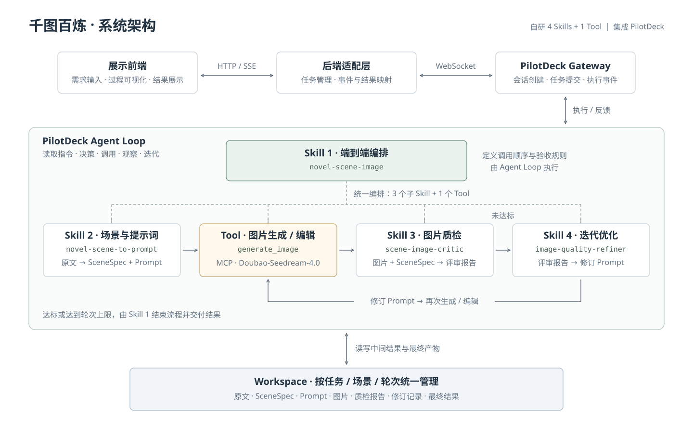

# 千图百炼 · Novel-to-Image

基于 **PilotDeck** 的小说场景图像创作 Agent。输入一段小说或画面描述，系统自动完成场景分析、提示词生成、图片生成、质量评审与迭代优化，并通过工作流面板展示每一步的输出。

## 功能

- **端到端创作**：将原文转换为 SceneSpec 和 Prompt，生成图片并根据质检结果持续优化。
- **多种生图能力**：封装 Doubao-Seedream-4.0，支持文生图、图生图、图片编辑、多图融合及组图生成。
- **执行可视化**：实时展示创作进度，点击步骤查看提示词、图片、质检报告和修订内容。
- **结果可追溯**：按场景与轮次保存产物；工作流面板支持任务链接访问与历史回放。

## Demo

[在线 Demo](https://eggry.github.io/novel-scene-to-image-skill/frontend/?taskid=demo) · [系统架构图](frontend/architecture.svg)

Demo 链接以仓库根目录部署到 GitHub Pages 为前提，需先启用 Pages。静态版回放一组真实任务的三轮生成记录，不连接后端、不调用模型；真实创作需运行 PilotDeck 与配套后端。

前端无需构建，部署说明见 [frontend/README.md](frontend/README.md)。

### 演示视频

<video src="./demo.mp4" controls muted width="100%">
  <a href="./demo.mp4">下载演示视频</a>
</video>

## 安装与使用

前置条件：已安装 PilotDeck、可运行 Node.js，并拥有可调用 Seedream 的 Paratera API Key。

1. 将 `skills/` 中的四个 Skill 目录复制到 `~/.pilotdeck/skills/`。
2. 将 `plugins/seedream/` 复制到 `~/.pilotdeck/plugins/seedream/`。
3. 在启动 PilotDeck 的环境中设置 `PARATERA_API_KEY`，然后重启 PilotDeck。
4. 在设置中确认 Seedream MCP 服务器已连接；若未自动发现，在「MCP 服务器」添加 STDIO 配置：

```json
{
  "mcpServers": {
    "seedream": {
      "command": "node",
      "args": ["${userHome}/.pilotdeck/plugins/seedream/server.mjs"],
      "env": {
        "PARATERA_API_KEY": "${env:PARATERA_API_KEY}"
      },
      "perSession": true,
      "callTimeoutMs": 300000
    }
  }
}
```

`~` 表示用户主目录。若 `node` 不在 PATH 中，将 `command` 改为本机 Node.js 可执行文件的绝对路径。API Key 仅保存在本机环境中。

新建 PilotDeck 会话，输入：

> 请使用 novel-scene-image Skill，将以下小说片段生成一张场景图，执行图片质检，并根据评审结果迭代优化：  
> 孔乙己站在酒馆柜台前，排出九文大钱。身旁的短衣酒客看着他哄笑，他涨红了脸，争辩着“窃书不能算偷”。

工具在 MCP 中的名称为 `mcp__seedream__generate_image`。前端真实任务接口见 [接入说明](frontend/integration.md)。

## 系统架构

我们开发了 **4 个 Skill 和 1 个 MCP Tool**，复用 PilotDeck 的 Agent Loop、Gateway 和 Workspace 执行能力。

| 模块 | 职责 |
| --- | --- |
| `novel-scene-image` | 主 Skill：编排其余 Skill 与 Tool，定义迭代、验收与停止规则 |
| `novel-scene-to-prompt` | 子 Skill：原文 → SceneSpec → 初始 Prompt |
| `scene-image-critic` | 子 Skill：对照场景需求评审图片，输出评分与问题 |
| `image-quality-refiner` | 子 Skill：根据评审结果生成修订 Prompt |
| `generate_image` | Tool：调用 Seedream API，保存图片与生成记录 |

**Agent Loop** 按主 Skill 的规则执行“生成 → 评审 → 修订 → 再生成”，直至达标或达到迭代上限。Skill 提供工作流指令，实际读取与工具调用由 Agent 执行。

**Gateway** 连接后端适配层与 PilotDeck：后端创建会话、提交任务并接收执行事件，结合 Workspace 产物映射为前端 SSE 进度。

**Workspace** 统一管理原文、SceneSpec、Prompt、图片、评审和修订记录，产物保存在 `scenes/<scene_id>/iterations/<NN>/`。当前实现按场景目录隔离任务。


